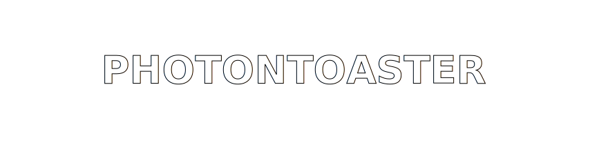

# <div align="center">PhotonToaster</div>

<div align="center">
  
</div>

<div align="center">


</div>

---

## What This Is

PhotonToaster is a shell setup toolkit with:

- Cyberpunk-style prompt and color system
- Cross-shell alias generation from a single TOML source
- Shell-specific init/integration files for `bash`, `zsh`, `fish`, `nushell`, and `powershell`
- Install entrypoints at repo root: `./install` (bash) and `./install.ps1` (PowerShell)

---

## Quick Install

```bash
git clone <your-repo-url> photontoaster
cd photontoaster
./install
```

### Windows (PowerShell)

```powershell
git clone <your-repo-url> photontoaster
cd photontoaster
.\install.ps1
```

The installer will:

- Ask which shell you want to configure (bash installer) or configure PowerShell directly (PowerShell installer)
- Install files under `~/.config/photontoaster` (or `PHOTONTOASTER_CONFIG_DIR`)
- Generate aliases
- Wire your shell startup config
- Optionally switch your login shell

---

## Core Commands

```bash
# regenerate aliases from config/aliases.toml
./scripts/generate_aliases.sh

# run syntax + sanity checks
./scripts/pt-selfcheck

# benchmark shell startup times
./scripts/pt-bench-startup

# benchmark PowerShell startup only
./scripts/pt-bench-powershell --json docs/benchmarks/powershell-latest.json
```

---

## Layout

```text
.
├── install                  # single root entrypoint
├── bash/                    # bash config pieces
├── zsh/                     # zsh config pieces
├── fish/                    # fish config pieces
├── nushell/                 # nushell config pieces
├── powershell/              # powershell config pieces
├── shared/                  # cross-shell env/helpers/generated aliases.sh
├── scripts/                 # tooling (generate/check/bench)
├── config/                  # aliases.toml + config.toml.default
└── docs/                    # docs and guides
```

For more detail, see `docs/layout.md`.

---

## Styling + Themes

Color presets live in `config/config.toml` under `[colors]` and include:

- `default`
- `astra`
- `catppuccin`
- `cracktro`
- `dracula`
- `pastels`
- `solarized`
- `terminal`

If you want max neon chaos, use:

```toml
[colors]
scheme = "cracktro"
```

---

## Shell Notes

- **zsh**: richest polished experience in this repo
- **fish**: modern UX, friendly defaults
- **bash**: widest compatibility
- **nushell**: structured data flow style
- **powershell**: strong Windows-native shell + object pipeline

See `docs/choosing-a-shell.md` for the full decision guide.

---

## Generated Files

From `config/aliases.toml`, the generator produces:

- `shared/aliases.sh`
- `fish/aliases.fish`
- `nushell/aliases.nu`
- `powershell/aliases.ps1`

Do not hand-edit those generated alias files.

---

## Hyperlink Research

Terminal hyperlink behavior notes are documented in:

- `docs/terminal-hyperlinks.md`
- `docs/cool-stuff-roadmap.md`

---

<div align="center">
  
</div>

